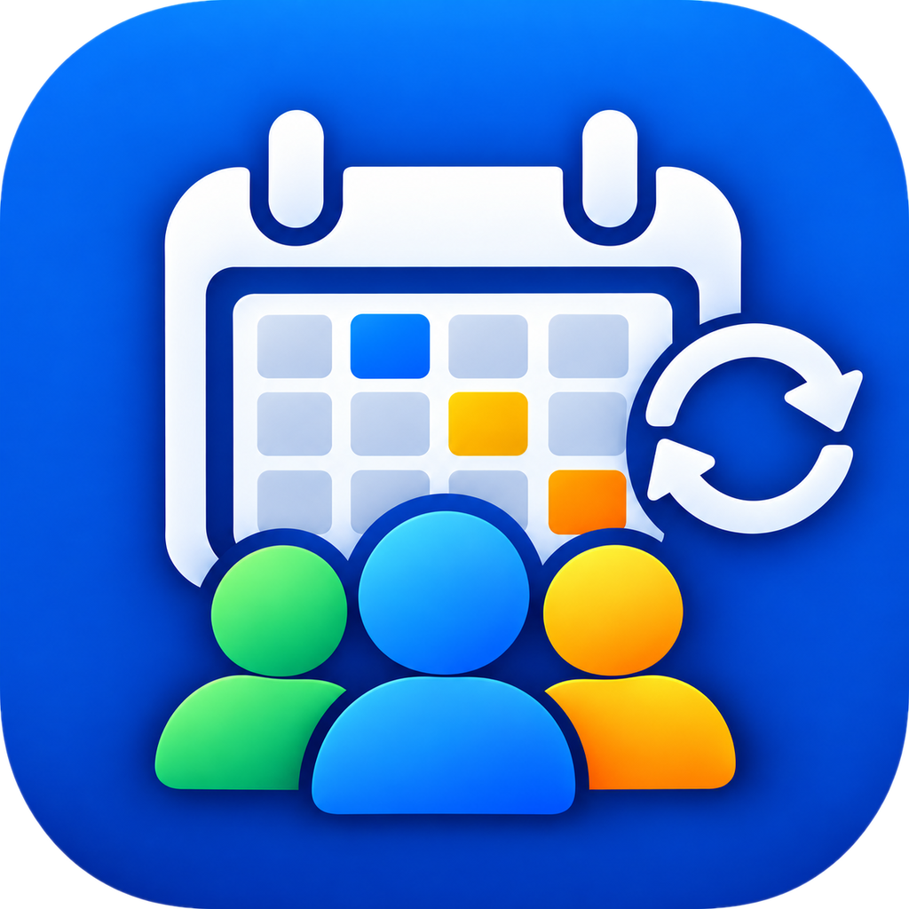

<div align="center">

  

  # Kalendář směn
  **Chytré, bleskové a přehledné plánování pracovních směn pro celou rodinu.**

  <br/>

  <p>
    <a href="https://github.com/Patrik-Rybka/Shift-Calendar/releases/latest/download/kalendar-smen.apk">
      
    </a>
    &nbsp;&nbsp;
    <a href="https://github.com/Patrik-Rybka/Shift-Calendar/releases/latest">
      
    </a>
  </p>

</div>

---

## ✨ Klíčové funkce

- 👨‍👩‍👧‍👦 **Všechny směny na jednom místě**  
  Propojte celou rodinu jednoduše pomocí jednoho společného kódu. Okamžitě vidíte, kdo má ranní, odpolední, noční nebo volno.

- ⚡ **Offline-first & Blesková rychlost**  
  Aplikace reaguje okamžitě a bez čekání. Změny se ukládají v telefonu ihned a na pozadí se synchronizují s cloudovou PostgreSQL databází Neon. Plně funkční i bez internetu.

- 🎨 **5 stylů zobrazení kalendáře**  
  Každý si může vybrat vzhled mřížky podle svých preferencí:
  1. **Barevné bloky** – celý název směny i jméno člena bez ořezávání (maminka styl).
  2. **Celé probarvení políčka** – jasný přehled s rozdělením dne napůl při více směnách.
  3. **Barevný proužek** – decentní spodní lišta pro kompaktní přehled.
  4. **Barevné pilulky** – moderní štítky s puntíkem a popisem.
  5. **Minimalistické tečky** – čisté barevné puntíky pod číslem dne.

- 📤 **Snadné pozvání rodiny**  
  Přímo v aplikaci stačí ťuknout na *Sdílet pozvánku* a odeslat zprávu s kódem a odkazem ke stažení přes WhatsApp, SMS nebo Messenger.

- 🇨🇿 **České státní svátky & Čísla týdnů**  
  Automatický výpočet všech pevných i pohyblivých svátků (včetně Velikonoc) a volitelné zobrazení ISO týdnů.

- 🔒 **Soukromí rodiny & Oprávnění**  
  Možnost zabezpečit skupinu heslem/PINem, schvalování nových členů správcem a podpora virtuálních profilů pro rodinné příslušníky bez telefonu (děti, prarodiče).

- 🔄 **Pohodlné aktualizace**  
  Když vyjde nová verze, aplikace vás sama upozorní. Jedním klikem stáhnete instalační balíček přímo z prohlížeče bez nutnosti hledání na webu.

- 🌓 **Tmavý & Světlý režim**  
  Plná podpora nočního šetřícího režimu, automatického přizpůsobení systému a volitelné velikosti písma.

---

## 📲 Jak nainstalovat aplikaci do telefonu

1. V telefonu klikněte na **[Stáhnout nejnovější APK](https://github.com/Patrik-Rybka/Shift-Calendar/releases/latest/download/kalendar-smen.apk)**.
2. V notifikační liště nebo ve složce *Stažené soubory* klepněte na stažený soubor `kalendar-smen.apk`.
3. Pokud se zobrazí dotaz na *Povolení instalace z neznámých zdrojů* (např. Chrome), potvrďte povolení.
4. Zvolte **Instalovat** a poté aplikaci otevřete.
5. Zadejte kód vaší rodinné skupiny a kalendář je připraven!

---

## 🛠️ Použité technologie

| Komponenta | Technologie |
|---|---|
| **Platforma** | Android (samostatný APK balíček) |
| **Framework** | Expo SDK 57 / React Native 0.86 |
| **Jazyk** | TypeScript |
| **Databáze** | Neon Serverless PostgreSQL |
| **Správa stavu** | Zustand (s offline AsyncStorage perzistencí) |
| **CI / CD** | GitHub Actions (automatická kompilace APK) |

---

## 💻 Lokální vývoj

```bash
# 1. Klonování repozitáře
git clone https://github.com/Patrik-Rybka/Shift-Calendar.git
cd Shift-Calendar

# 2. Instalace závislostí
npm install

# 3. Spuštění vývojového serveru
npx expo start
```

---

<div align="center">
  <sub>Vytvořeno s ❤️ pro celou rodinu</sub>
</div>
